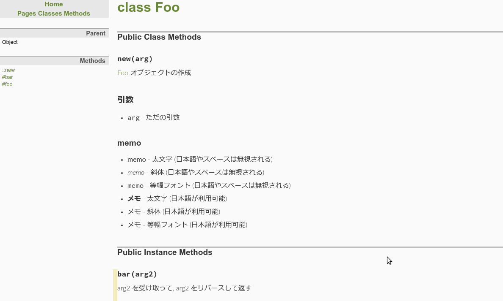

# 2018/04/22 今日のるびぃ

## 今日のるびぃ ~ RDoc でドキュメントを作成してみる ~

引き続き, [プロを目指す人のためのRuby入門 言語仕様からテスト駆動開発・デバッグ技法まで](http://gihyo.jp/book/2017/978-4-7741-9397-7) のコラム (P.232) に記載されている「RDoc で API ドキュメントを作成する」を写経する.

### サンプルコード

以下のようなクラスにコメントを書いていく.

```ruby
class Foo
  CONST = [:const1, :const2, :const3] # :nodoc:
  
  # Foo オブジェクトの作成
  # === 引数
  # * +arg+ - ただの引数
  # === memo
  # * *memo* - 太文字 (日本語やスペースは無視される)
  # * _memo_ - 斜体 (日本語やスペースは無視される)
  # * +memo+ - 等幅フォント (日本語やスペースは無視される)
  # * <b>メモ</b> - 太文字 (日本語が利用可能)
  # * <em>メモ</em> - 斜体 (日本語が利用可能)
  # * <tt>メモ</tt> - 等幅フォント (日本語が利用可能)
  def initialize(arg)
    @arg0 = arg
  end
 
  # arg1 を受け取って, arg1 を大文字で返す
  # === 引数 (見出し 3)
  # * +arg1+ - 引数 1
  # === 戻り値 (見出し 3)
  # * +string+ - arg1 が ARG1 となる
  # === 番号付きリスト (見出し 3)
  # 1. 見出し1
  # 2. 見出し2
  def foo(arg1)
    arg1.upcase
  end

  # arg2 を受け取って, arg2 をリバースして返す
  # === 引数
  # * +arg2+ - 引数 2  
  # === 戻り値
  # * +string+ - arg2 が 2gra となる
  # === リスト (見出し 3)
  # * リスト 1
  # * リスト 2
  def bar(arg2)
    arg2.reverse
  end

  private

  # private メソッドはドキュメントに出力されない
  # arg3 を受け取って, arg3 に `_private` という文字列を付与して返す
  # === 引数
  # * +arg3+ - 引数 3 
  # === 戻り値
  # * +string+ - arg3 が arg3_private となる
  def bar(arg2)
    arg3 + '_private'
  end
end
```

このクラスは, 以下のようなディレクトリ構成で保存する.

```sh
$ tree lib/
lib/
└── foo.rb

0 directories, 1 file
```

RDoc の詳細については, 以下のドキュメントに記載されている.

* https://docs.ruby-lang.org/ja/latest/library/rdoc.html

マークアップについては, 以下のドキュメントから詳細を辿ることが出来る.

* https://docs.ruby-lang.org/ja/latest/library/rdoc=2fmarkup.html

### ドキュメントを生成

Ruby のバージョンは以下の通り.

```sh
$ ruby --version
ruby 2.5.1p57 (2018-03-29 revision 63029) [x86_64-linux]
```

以下のように実行する.

```sh
$ rdoc lib/foo.rb
```

以下のように出力される.

```ruby
Parsing sources...
100% [ 1/ 1]  lib/foo.rb

Generating Darkfish format into /path/to/doc...

  Files:      1

  Classes:    1 (1 undocumented)
  Modules:    0 (0 undocumented)
  Constants:  0 (0 undocumented)
  Attributes: 0 (0 undocumented)
  Methods:    3 (0 undocumented)

  Total:      4 (1 undocumented)
   75.00% documented

  Elapsed: 0.1s

```

以下のように doc ディレクトリが作成され, 生成した HTML が保存されている.

```sh
$ tree . -L 2 -n
.
├── doc
│   ├── Foo.html
│   ├── created.rid
│   ├── css
│   ├── fonts
│   ├── images
│   ├── index.html
│   ├── js
│   └── table_of_contents.html
└── lib
    └── foo.rb

6 directories, 5 files
```

生成されたドキュメントをブラウザで開いてみると, 以下のように出力される.



ﾌﾑﾌﾑ
