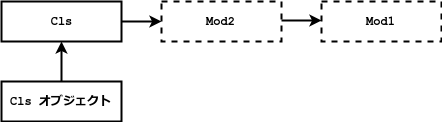
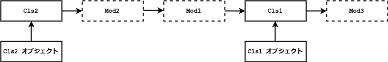

# 2018/05/17 今日のるびぃ

## 今日のるびぃ ~ REx - Ruby Examination にチャレンジ (4) ~

[REx - Ruby Examination](https://rex.libertyfish.co.jp/) の問題を自分なりにアレンジした上で 1 〜 3 問くらいずつ解いていく. 正直言ってかなり難しい. 尚, irb に動作確認環境は以下の通り.

```ruby
$ ruby --version
ruby 2.1.10p492 (2016-04-01 revision 54464) [x86_64-linux]
$ irb --version
irb 0.9.6(09/06/30)
```

### Enumerator::Lazy

以下のプログラムはEnumerator::Lazyを使っている. 先頭から 5 つの値を取り出すにはどのメソッドが必要か.

```ruby
(1..10).lazy.map{|num| num + 1}
```

> first(5)
> take(5).force

以下, irb にて動作確認.

```ruby
irb(main):011:0> (1..10).lazy.map{|num| num + 1}
=> #<Enumerator::Lazy: #<Enumerator::Lazy: 1..10>:map>
irb(main):012:0> (1..10).lazy.map{|num| num + 1}.first(5)
=> [2, 3, 4, 5, 6]
irb(main):013:0> (1..10).lazy.map{|num| num + 1}.take(5)
=> #<Enumerator::Lazy: #<Enumerator::Lazy: #<Enumerator::Lazy: 1..10>:map>:take(5)>
irb(main):014:0> (1..10).lazy.map{|num| num + 1}.take(5).force
=> [2, 3, 4, 5, 6]
```

以下, 解説より抜粋.

* Lazy から値を取り出すには, Enumerator::Lazy#force または Enumerable#first を呼び出す
* 設問では「先頭から 5 つ」とあるので, `first(5)` として取り出す
* Enumerator::Lazy#take は Enumerable#take と異なり, Enumerator::Lazyのインスタンスを返す為, Enumerator::Lazy#force を利用して値を取り出す

以下, 関連するメソッドについて整理.

| メソッド | 詳細 |
|:---|:---|
| Enumerable#first | Enumerable オブジェクトの最初の要素, もしくは最初の n 要素を返す |
| Enumerator::Lazy#take | Enumerable#take と同じですが, 配列ではなく Enumerator::Lazy を返す |
| Enumerator::Lazy#force | 全ての要素を含む配列を返. Lazy から実際に値を取り出すのに使う |

### mix-in (メソッドの探索)

以下のコードを実行するとどうなるか.

```ruby
module Mod1
end

module Mod2
end

module Mod3
end

class Cls
  include Mod1
  include Mod2
  include Mod3
end

p Cls.ancestors
```

> [Cls, Mod3, Mod2, Mod1, Object, Kernel, BasicObject]

以下, irb で確認.

```ruby
irb(main):017:0> Cls.ancestors
=> [Cls, Mod3, Mod2, Mod1, Object, Kernel, BasicObject]
```

以下, 解説より抜粋.

* include はモジュールのメソッドをインスタンスメソッドとして追加する
* メソッド探索順は self の後に追加される
* 複数回 include された場合には, 後に宣言されたモジュールのメソッドから探索される

図示すると以下のような感じになる.



さらに, 以下のような場合にどうなるか.

```ruby
module Mod1
end

module Mod2
end

module Mod3
end

class Cls1
  include Mod3
end

class Cls2 < Cls1
  include Mod1
  include Mod2
end

p Cls1.ancestors
p Cls2.ancestors
```

> [Cls1, Mod3, Object, Kernel, BasicObject]
> [Cls2, Mod2, Mod1, Cls1, Mod3, Object, Kernel, BasicObject]

以下, irb による確認.

```ruby
irb(main):019:0> p Cls1.ancestors
[Cls1, Mod3, Object, Kernel, BasicObject]
=> [Cls1, Mod3, Object, Kernel, BasicObject]
irb(main):020:0> p Cls2.ancestors
[Cls2, Mod2, Mod1, Cls1, Mod3, Object, Kernel, BasicObject]
=> [Cls2, Mod2, Mod1, Cls1, Mod3, Object, Kernel, BasicObject
```

以下, 解説.

* include が実行されると, インタプリタは指定されたモジュールに対する無名クラスを作成して, スーパークラスとの間に組み入れる
* 上記だと, Cls2 と Cls1 の間に Mod2 と Mod1 は挿入される

図示すると以下のような感じになる.



ﾌﾑﾌﾑ.
