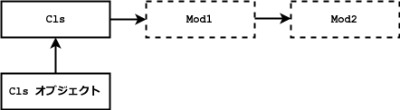

# 2018/05/20 今日のるびぃ

## 今日のるびぃ ~ REx - Ruby Examination にチャレンジ (7) ~

[REx - Ruby Examination](https://rex.libertyfish.co.jp/) の問題を自分なりにアレンジした上で 1 〜 3 問くらいずつ解いていく. 正直言ってかなり難しい. 尚, irb に動作確認環境は以下の通り.

```ruby
$ ruby --version
ruby 2.1.10p492 (2016-04-01 revision 54464) [x86_64-linux]
$ irb --version
irb 0.9.6(09/06/30)
```

### モジュールメソッド探索

以下のコードを実行するとどうなるか.

```ruby
module Mod1; end

module Mod2; end

class Cls
  include Mod1, Mod2
end

p Cls.ancestors
```

> [Cls, Mod1, Mod2, Object, Kernel, BasicObject]

以下, irb にて確認.

```ruby
irb(main):001:0> module Mod1; end
=> nil
irb(main):002:0> 
irb(main):003:0* module Mod2; end
=> nil
irb(main):004:0> 
irb(main):005:0* class Cls
irb(main):006:1>   include Mod1, Mod2
irb(main):007:1> end
=> Cls
irb(main):008:0> 
irb(main):009:0* p Cls.ancestors
[Cls, Mod1, Mod2, Object, Kernel, BasicObject]
=> [Cls, Mod1, Mod2, Object, Kernel, BasicObject]
```

以下, 解説より抜粋.

* `include` はモジュールのメソッドをインスタンスメソッドとして追加する
* メソッド探索順は `self` の後に追加される
* 複数モジュールを指定した場合は, 最初に指定したメソッド探索される (設問だと Mod1 が優先される)

以下, 探索の順番を図示したもの.



以下, `include` でモジュールを指定する順番の違い.

```ruby
module Mod1
  def foo
    p 'Mod1#foo'
  end
end

module Mod2
  def foo
    p 'Mod2#foo'
  end
end

class Cls1
  include Mod1, Mod2
  def bar
    foo
  end
end

p Cls1.new.bar #=> "Mod1#foo"

class Cls2
  include Mod1
  include Mod2
  def bar
    foo
  end
end

p Cls2.new.bar #=> "Mod2#foo"
```

### 定数探索

以下のコードを実行するとどうなるか.

```ruby
module Mod1
  def refer_const
    CONST
  end
end

module Mod2
  CONST = '010'
end

class Cls1
  CONST = "001"
end

class Cls2 < Cls1
  include Mod2
  include Mod1
  CONST = '100'
end

c = Cls2.new
p c.refer_const
```

> Mod1#refer_const が呼ばれるが, Mod1 内に CONST は未定義なので例外が発生する

以下, irb による動作確認.

```ruby
irb(main):021:0* c = Cls2.new
=> #<Cls2:0x0055ce2eda1ab8>
irb(main):022:0> p c.refer_const
NameError: uninitialized constant Mod1::CONST
```

以下, 解説より抜粋.

* `refer_const` はモジュール Mod1 にあるが, CONST はレキシカルスコープとなる為, モジュール Mod1 のスコープを探索する
* 設問では `CONST` が見つからないため例外が発生する

以下のように Mod1 内に CONST を定義することで, 例外は回避出来る.

```ruby
module Mod1
  CONST = '000'
  def refer_const
    CONST
  end
end

module Mod2
  CONST = '010'
end

class Cls1
  CONST = "001"
end

class Cls2 < Cls1
  include Mod1
  CONST = '100'
end

c = Cls2.new
p c.refer_const
```

irb で実行すると, 以下のように `000` が出力される.

```ruby
irb(main):021:0* c = Cls2.new
=> #<Cls2:0x00562baf7e4fb0>
irb(main):022:0> p c.refer_const
"000"
=> "000"
```

ﾌﾑﾌﾑ.
